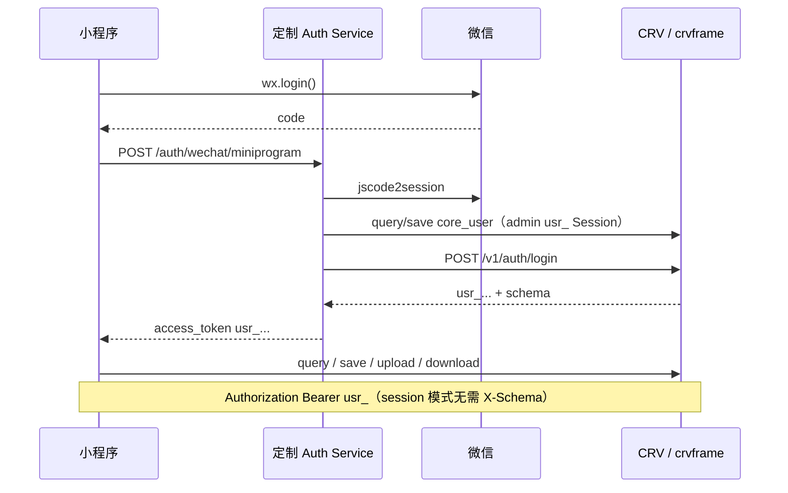

# 谷子私库 — CRV / crvframe 对接说明

> 小程序 ↔ **定制 Auth Service** ↔ **CRV Service**  
> API 规范：[public_api.md](./public_api.md) **v1.4**（Redis Session）  
> 架构总览：[tech.md](./tech.md)

---

## 1. 架构与职责



| 步骤 | 负责方 |
|------|--------|
| 微信 code 换 openid | **Auth Service** |
| 同步 `core_user` / 角色 | **Auth Service**（admin Session 调 CRV save） |
| 签发用户 Session（`usr_...`） | **CRV**（Auth 代调 `/v1/auth/login`） |
| 谷子 CRUD、附件 | **CRV** |
| OSS 读写 | **CRV**（upload/download） |

---

## 2. 环境配置

### 2.1 小程序 `config/env.js`（示例）

```javascript
module.exports = {
  AUTH_BASE_URL: 'https://auth.example.com',
  CRV_BASE_URL: 'https://api.example.com',
  // session 模式：schema 已绑在 Session，CRV 请求无需再传
  ITEM_MODEL_ID: 'owned_item',
  PHOTOS_FIELD_ID: 'photos',
}
```

### 2.2 小程序合法域名

- `AUTH_BASE_URL` → request
- `CRV_BASE_URL` → request、uploadFile、downloadFile

---

## 3. 认证对接

> CRV 鉴权见 [public_api.md §3](./public_api.md#3-认证)：**Session 模式**（`usr_...`），非 JWT。小程序业务请求携带 Auth 返回的 Session 令牌。

### 3.1 Auth Service 接口（定制，不在 public_api.md）

```http
POST {AUTH_BASE_URL}/auth/wechat/miniprogram
Content-Type: application/json

{
  "code": "081xxx",
  "nickname": "收藏家",
  "avatar_url": "https://..."
}
```

**响应：**

```json
{
  "access_token": "usr_xK9mN2pQ...",
  "token_type": "Bearer",
  "expires_in": 900,
  "is_new_user": true,
  "user": {
    "id": "u_wx_001",
    "nickname": "收藏家",
    "avatar_url": "https://..."
  }
}
```

| 字段 | 说明 |
|------|------|
| `access_token` | CRV Session（`usr_` 前缀），用于所有 CRV API |
| `expires_in` | 空闲过期秒数（默认 900）；使用中滑动续期 |

### 3.2 Auth Service 内部流程

1. `code2session` → `openid`
2. 使用 **admin `usr_` Session**（环境变量配置）在 CRV：
   - `query` 按 `openid` 查 `core_user`
   - 不存在则 `save create` + `roles` 绑定 `gushi_user`（并写入服务端内部 `password`）
   - 存在则可选 `update` 昵称/头像
3. 调用 CRV `POST /v1/auth/login`：

```json
{
  "username": "<core_user 登录名，待运营确认>",
  "password": "<服务端内部密码>",
  "appid": "gushi"
}
```

4. 将 CRV 登录响应中的 `access_token`、`expires_in` 转给小程序（schema 已绑 Session，无需下发）

> **实现状态**：`auth-service/` 当前仍为 JWT 草案，须按本节重构。

### 3.3 CRV Session 与权限

| Session 字段 | 谷子对应 |
|-------------|----------|
| `sub` | `core_user.id` |
| `roles` | `core_role_core_user` 关联，如 `["gushi_user"]` |
| `schema` | `gushi` |

`create_user` / datasets `%{CURRENT_USER_ID}` 取自 Session `sub`（public_api §6.4、§8）。

### 3.4 CRV 请求公共头（session 模式）

```javascript
{
  'Content-Type': 'application/json',
  'Authorization': `Bearer ${token}`  // token 为 usr_...
  // session 模式：无需 X-Schema / appDb（schema 已绑在 Session）
}
```

**Session 失效**（401，`session expired or revoked` 等）：清除本地 token → 重新走 Auth 微信登录。

**disabled 开发模式**（仅本地）：可省略 Token，须显式传 `X-Schema` + `X-Roles`；勿用于生产。

---

## 4. 模型与字段映射

> 物理 DDL 见 [schema.sql](./schema.sql)。  
> **待 crvframe 落库后**，以 `GET /v1/meta/models?schema=gushi` 为准核对 model.json。

### 4.0 用户 `core_user`

| 说明 | 值 |
|------|-----|
| modelId | `core_user` |
| 主键 | `id` VARCHAR，= Session `sub` |
| 中文名称 | `user_name_zh` | Auth 同步时可填微信昵称 |
| 英文名称 | `user_name_en` | 可选 |
| 密码 | `password` | crvframe 标准字段；MVP 微信登录可为空 |
| 角色 | `roles` | many2many → `core_role`，中间表 `core_role_core_user` |
| 同步 | Auth 微信登录后 `save create/update`，并绑定 `gushi_user` 角色 |

### 4.0.1 角色 `core_role`

| 说明 | 值 |
|------|-----|
| modelId | `core_role` |
| 主键 | `id` VARCHAR（如 `gushi_user`、`admin`） |
| 业务字段 | `remark` 备注 |
| 审计列 | `version`、`create_user`、`create_time`、`update_user`、`update_time` |
| Session `roles` | 须与 `core_role.id` 一致（MVP 至少含 `gushi_user`）；宜与 `core_user.roles` 关联保持一致 |

**save 绑定角色示例：**

```json
{
  "modelId": "core_user",
  "list": [
    {
      "_save_type": "create",
      "id": "u_wx_001",
      "user_name_zh": "收藏家",
      "roles": {
        "fieldType": "many2many",
        "relatedModelId": "core_role",
        "associationModelId": "core_role_core_user",
        "list": [
          { "_save_type": "create", "id": "gushi_user" }
        ]
      }
    }
  ]
}
```

> query 时在 `fields` 中声明 `roles` 的 `fieldType: "many2many"` 与 `relatedModelId` 可嵌套查询角色信息。

### 4.1 主表 `owned_item`

| 谷子逻辑字段 | CRV 列名 | 类型 | 说明 |
|-------------|----------|------|------|
| id | `id` | BIGINT AUTO_INCREMENT | update/delete 必填 |
| version | `version` | int | 乐观锁 |
| 名称 | `name` | string | |
| IP | `ip` | string | |
| 角色 | `character_name` | string | |
| 品类 | `category` | string | badge/stand/… |
| 版本类型 | `version_type` | string | normal/limited/… |
| 社团 | `circle` | string | 同人可选 |
| 作者 | `author` | string | 同人可选 |
| 状态 | `status` | string | pending/received/… |
| 存放位置 | `location` | string | |
| 标签 | `tags` | string VARCHAR(512) | 主表文本，`,tag1,tag2,` 格式，见 §4.3 |
| 购入价 | `purchase_price` | decimal | |
| 购入日期 | `purchase_date` | date | |
| 购入渠道 | `purchase_source` | string | |
| 订单号 | `order_no` | string | |
| 备注 | `note` | text | |
| 图片 | `photos` | **file → owned_item_attach** | §6.6.1 |
| 创建人 | `create_user` | string | = `core_user.id` |
| 创建时间 | `create_time` | datetime | CRV 自动 |

### 4.2 附件 `photos`（file）

- attach 表默认：`owned_item_attach`
- 上传得 `path` 后，在 save 中：

```json
"photos": {
  "fieldType": "file",
  "list": [
    {
      "_save_type": "create",
      "path": "gushi/pending/u_wx_001/abc....jpg",
      "name": "photo.jpg",
      "ext": ".jpg"
    }
  ]
}
```

### 4.3 标签 `tags`（主表文本）

标签存于 `owned_item.tags`，不用子表。采用**首尾逗号包裹**的 canonical 格式，避免 `Op.like` 误匹配：

| 用户输入 | 存库值 |
|---------|--------|
| `限定`, `初版` | `,限定,初版,` |
| 无标签 | ``（空字符串） |

**写入（小程序侧）：**

1. trim、去空、去重
2. 拼成 `,${tag1},${tag2},`

**展示：** `tags.split(',').filter(Boolean)`

**筛选（单标签）：**

```json
{ "tags": { "Op.like": "%,限定,%" } }
```

**筛选（多标签 AND）：**

```json
{
  "Op.and": [
    { "tags": { "Op.like": "%,限定,%" } },
    { "tags": { "Op.like": "%,初版,%" } }
  ]
}
```

**save 示例：**

```json
{
  "_save_type": "create",
  "name": "吧唧",
  "tags": ",限定,官谷,"
}
```

> 标签云 / 全库去重：MVP 由客户端从已加载列表聚合；若后续需要服务端统计，再考虑独立 tag 表（v1.1+）。

---

## 5. datasets.json 建议（私库隔离）

路径：`apps/gushi/owned_item/datasets.json`。根节点须为对象（含 `datasets` 数组），不可为顶层 JSON 数组：

```json
{
  "datasets": [
    {
      "name": "gushi_user_own_items",
      "queryRoles": "gushi_user",
      "mutationRoles": "gushi_user",
      "Filter": {
        "create_user": { "Op.eq": "%{CURRENT_USER_ID}" }
      }
    }
  ]
}
```

**目标：**

- 角色 `gushi_user` 可读写
- 仅能看到 / 改 / 删 **`create_user = 当前用户 sub`** 的行
- create 时 CRV 自动写 `create_user`，行级 Filter 主要约束 query/update/delete

**须与 crvframe 运营确认：**

- `%{CURRENT_USER_ID}` 是否等于 Session `sub`
- create 是否不做行级校验（§8.2）—— 依赖 `create_user` 自动填充，禁止客户端伪造

attach 表 `owned_item_attach` 亦需 datasets，或通过 download 接口的主表行权限间接保护（§6.7）。

---

## 6. 用户故事 ↔ API 映射

| 用户故事 | Auth Service | CRV API |
|----------|--------------|---------|
| US-AUTH-01 微信登录 | `POST /auth/wechat/miniprogram` | — |
| US-AUTH-02 私库隔离 | Session `sub` + roles | datasets + download 权限 |
| US-ADD-01/03 新增 | — | `save` create |
| US-ADD-02 上传图片 | — | `upload` → `save` file |
| US-BROWSE-01～04 | — | `query` |
| US-BROWSE-02 详情图 | — | `query` + `download` |
| US-EDIT-01/02 | — | `save` update/delete |
| US-EXPORT-01 | — | 分页 `query` → 本地 CSV/JSON |
| US-STAT-*（P1） | — | `query` + `withSummarize` |

---

## 7. 常用请求示例

> **session 模式**：下列示例中的 `X-Schema` 可省略；`Authorization` 使用 `usr_...` Session。示例保留 `X-Schema` 便于与 disabled 模式对照。

### 7.1 列表（分页 + 筛选）

```json
POST /v1/data/query
X-Schema: gushi

{
  "modelId": "owned_item",
  "fields": [
    { "field": "id" },
    { "field": "version" },
    { "field": "name" },
    { "field": "ip" },
    { "field": "category" },
    { "field": "status" },
    { "field": "tags" },
    {
      "field": "photos",
      "fieldType": "file",
      "fields": [
        { "field": "id" },
        { "field": "name" },
        { "field": "path" }
      ]
    }
  ],
  "filter": {
    "Op.and": [
      { "category": { "Op.eq": "badge" } },
      { "tags": { "Op.like": "%,限定,%" } },
      {
        "Op.or": [
          { "name": { "Op.like": "%原神%" } },
          { "ip": { "Op.like": "%原神%" } },
          { "character_name": { "Op.like": "%原神%" } },
          { "note": { "Op.like": "%原神%" } },
          { "tags": { "Op.like": "%原神%" } }
        ]
      }
    ]
  },
  "sorter": [{ "field": "create_time", "order": "desc" }],
  "pagination": { "current": 1, "pageSize": 20 }
}
```

> query 返回的 `photos` 嵌套结构 **须联调确认**；`attachId` 用于 download 的 `attachId` 参数。

### 7.2 新增（仅文字）

```json
POST /v1/data/save

{
  "modelId": "owned_item",
  "list": [
    {
      "_save_type": "create",
      "name": "吧唧",
      "ip": "原神",
      "category": "badge",
      "status": "received",
      "tags": ",限定,官谷,"
    }
  ]
}
```

响应 `lastInsertId` / `generatedKeys` → 再 query 得 `version`。

### 7.3 上传图片

```http
POST /v1/files/upload
Content-Type: multipart/form-data
Authorization: Bearer ...
X-Schema: gushi

file=<binary>
```

### 7.4 保存图片到谷子

```json
POST /v1/data/save

{
  "modelId": "owned_item",
  "list": [
    {
      "_save_type": "update",
      "id": 42,
      "version": 0,
      "photos": {
        "fieldType": "file",
        "list": [
          {
            "_save_type": "create",
            "path": "gushi/pending/u_wx_001/xxx.jpg",
            "name": "a.jpg",
            "ext": ".jpg"
          }
        ]
      }
    }
  ]
}
```

### 7.5 下载缩略图（列表）

```http
GET /v1/files/download?modelId=owned_item&rowId=42&fieldId=photos&attachId=7&maxWidth=400
Authorization: Bearer ...
X-Schema: gushi
```

小程序：

```javascript
wx.downloadFile({
  url: `${CRV_BASE_URL}/v1/files/download?...`,
  header: { Authorization: `Bearer ${token}` },
  success(res) {
    // res.tempFilePath → <image src="">
  }
})
```

### 7.6 删除谷子

```json
{
  "modelId": "owned_item",
  "list": [
    { "_save_type": "delete", "id": 42, "version": 1 }
  ]
}
```

> 主行删除时 attach/OSS 是否级联 — **待 crvframe 确认**；若不级联，需先 delete `photos` 内各 attach。

---

## 8. 小程序 services 封装要点

### 8.1 `auth.js`

- `login()`：`wx.login` → Auth Service → `setStorageSync('token')`
- `getToken()` / `ensureLogin()`：无 token 跳转 P01
- 401 或启动时 token 可能已空闲过期 → 静默重新 `login()`

### 8.2 `crv.js`

- 统一 Envelope 解析 `{ code, message, data }`
- `Authorization: Bearer ${usr_token}`；session 模式**不传** `X-Schema`
- 401 → 清 token → 重新登录
- 409 → 抛出「数据已变更，请刷新」

### 8.3 `item.js`

- 封装 list / get / create / update / remove / copy
- 内部维护 `modelId`、字段名常量
- 上传：`uploadFile` → `save` 更新 photos

---

## 9. 与 public_api 的差异说明

| 勿用 | 改用 |
|------|------|
| 小程序直接调 CRV `/v1/auth/login` | Auth Service 微信登录后代换 Session |
| 自签 JWT / JWKS | CRV Redis Session（`usr_...`） |
| 自建 REST `/items` | CRV `query` / `save` |
| OSS 直传 PostPolicy | CRV `/v1/files/upload` |
| `<image src=downloadUrl>` | `wx.downloadFile` + tempFilePath |
| session 模式下多余的 `X-Schema` | Schema 已绑在 Session，勿再传 |

---

## 10. 联调 Checklist

- [ ] CRV `CRVSVC_AUTH_MODE=session` + Redis 已配置
- [ ] Auth 可换取有效 `usr_...`，`GET /v1/meta/models` 可调通
- [ ] `gushi` schema 下模型与 `datasets.json` 已配置
- [ ] 用户 A Session 无法 query/save/download 用户 B 的数据
- [ ] upload → save file → query 得 attachId → download 可显示
- [ ] update/delete 带 version，409 可正确处理
- [ ] Session 空闲过期后小程序可重新登录
- [ ] 分页 query 500 条性能可接受
- [ ] 导出：分页拉全量生成 CSV
