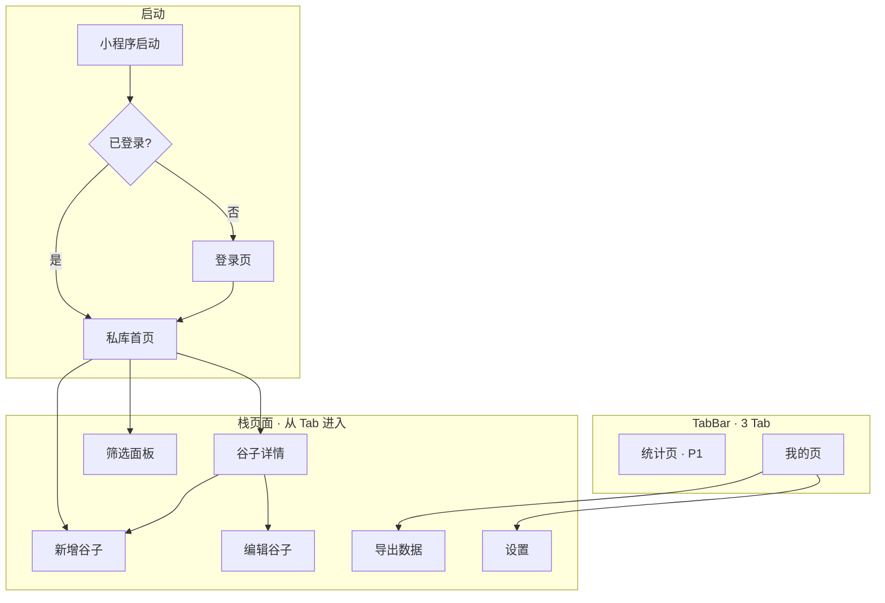

# 谷子私库 — 信息架构与页面清单

> 基于 [res.md](./res.md)、[user-stories.md](./user-stories.md) 整理。  
> 平台：**微信小程序** | 第一版：**已拥有私库** | **不含 Wishlist Tab**

---

## 1. 信息架构总览



---

## 2. TabBar 结构

| Tab | 页面 | 路径建议 | 优先级 | 说明 |
|-----|------|----------|--------|------|
| 私库 | 私库首页 | `pages/library/index` | P0 | 默认首页，网格/列表 + 搜索 |
| 统计 | 统计概览 | `pages/stats/index` | P1 | P0 阶段 Tab 可占位或隐藏 |
| 我的 | 我的 | `pages/me/index` | P0 | 导出、设置、关于 |

**第一版 Tab 策略（二选一，开发时定一种）：**

| 方案 | 做法 | 适用 |
|------|------|------|
| **A（推荐）** | 3 Tab 都显示；统计 Tab 先做简单占位（「即将完善」）或极简总数 | 结构一次定好，P1 只填内容 |
| **B** | P0 仅 2 Tab（私库 + 我的）；P1 再加统计 Tab | 最小界面，改 Tab 配置一次 |

---

## 3. 页面清单

### P01 登录页

| 项 | 内容 |
|----|------|
| **路径** | `pages/login/index` |
| **优先级** | P0 |
| **进入** | 未登录时启动、或会话失效后任意操作拦截跳转 |
| **离开** | 授权成功 → 私库首页（`usr_` Session + `schema` 存本地） |

**说明：** 调用 **定制 Auth Service** 换取 CRV Session；小程序不直接调 CRV `/v1/auth/login`。

**页面元素：**

- App 名称 + 一句话价值（「我的谷子收藏柜」）
- 微信一键登录按钮
- 简短隐私说明（数据仅本人可见）
- 登录失败提示 + 重试

**关联用户故事：** US-AUTH-01、US-AUTH-02

---

### P02 私库首页

| 项 | 内容 |
|----|------|
| **路径** | `pages/library/index` |
| **优先级** | P0 |
| **进入** | 登录后默认 Tab；新增/编辑/删除成功后返回 |
| **离开** | 详情、筛选、新增 |

**页面元素：**

| 区域 | 元素 |
|------|------|
| 顶栏 | 搜索框（名称/IP/角色/备注） |
| 工具栏 | 筛选入口、视图切换（网格/列表）、排序（P1）、**+ 新增** |
| 主内容 | 谷子卡片网格（默认）或列表行 |
| 卡片 | 主图缩略图、名称、IP（可选）、品类标签 |
| 空状态 | 插画/文案 +「添加第一件谷子」按钮 |
| 底栏 | TabBar |

**交互：**

- 点击卡片 → P03 详情
- 点击筛选 → P04 筛选（或底部弹层，见 §4）
- 长按卡片（P1 可选）→ 复制 / 删除快捷菜单
- 下拉刷新列表

**关联用户故事：** US-BROWSE-01、US-BROWSE-03、US-BROWSE-04、US-BROWSE-05（P1）

---

### P03 谷子详情

| 项 | 内容 |
|----|------|
| **路径** | `pages/item/detail` |
| **优先级** | P0 |
| **进入** | 私库首页点击条目 |
| **离开** | 返回列表；编辑；删除后回列表 |

**页面元素：**

| 区域 | 元素 |
|------|------|
| 图集 | 多图 swiper，支持预览大图 |
| 基础信息 | 名称、IP、角色、品类、版本类型 |
| 同人 | 社团、作者（有值才展示） |
| 状态 | 未发货/已到货/… |
| 交易 | 购入价、日期、渠道、订单号（私密字段，样式可略弱化） |
| 整理 | 标签、存放位置、备注 |
| 操作栏 | **编辑**、**删除**、复制（P1） |

**关联用户故事：** US-BROWSE-02、US-EDIT-01、US-EDIT-02、US-ADD-04（P1）

---

### P04 筛选

| 项 | 内容 |
|----|------|
| **路径** | 弹层组件或 `pages/library/filter` |
| **优先级** | P0 |
| **推荐形态** | **底部半屏弹层**（少一次页面跳转） |

**筛选项：**

- IP（文本或历史记录下拉，P0 可文本输入）
- 品类（多选：吧唧、立牌、手办…）
- 状态（多选）
- 标签（多选或输入）

**操作：** 重置、确认；结果数预览「共 N 件」

**关联用户故事：** US-BROWSE-04

---

### P05 新增 / 编辑谷子

| 项 | 内容 |
|----|------|
| **路径** | `pages/item/form` |
| **优先级** | P0 |
| **模式** | `mode=create` 新增；`mode=edit&id=` 编辑（复制 P1 可用 `mode=copy&id=`） |

**表单分区：**

| 分区 | 字段 |
|------|------|
| 图片 | 拍照、相册，多图，拖拽排序（P1 可后做） |
| 基础 | 名称*、IP、角色、品类（picker）、版本类型（picker） |
| 同人 | 社团、作者（版本=同人时展开或常显可选） |
| 状态 | 状态（picker）、存放位置 |
| 交易 | 购入价、购入日期、渠道、订单号 |
| 其他 | 标签（多标签输入）、备注 |

**校验：** 名称与图片至少一项；保存 / 取消

**关联用户故事：** US-ADD-01、US-ADD-02、US-ADD-03、US-EDIT-01

---

### P06 编辑谷子

与 **P05 共用同一页面**，`mode=edit`。不单独占路由时可合并为 P05。

---

### P07 统计页

| 项 | 内容 |
|----|------|
| **路径** | `pages/stats/index` |
| **优先级** | P1 |
| **进入** | TabBar「统计」 |

**页面元素（P1）：**

| 模块 | 内容 |
|------|------|
| 总览 | 谷子总数 |
| 品类分布 | 条形图或列表（吧唧 x 件…） |
| IP 分布 | Top N IP 及数量 |
| 投入 | 总购入价、本月新增；**隐藏金额**开关 |
| 说明 | 仅统计已拥有，不含 Wishlist |

**P0 占位（若 Tab 已显示）：** 仅展示总数 +「更多统计即将上线」

**关联用户故事：** US-STAT-01、US-STAT-02

---

### P08 我的页

| 项 | 内容 |
|----|------|
| **路径** | `pages/me/index` |
| **优先级** | P0 |
| **进入** | TabBar「我的」 |

**页面元素：**

| 入口 | 跳转 | 优先级 |
|------|------|--------|
| 头像/昵称 | P10 设置 | P1 昵称 |
| 导出我的数据 | P09 | P0 |
| 设置 | P10 | P0 |
| 关于 / 版本号 | 弹窗或子页 | P0 |

**关联用户故事：** US-EXPORT-01、US-AUTH-03（P1）

---

### P09 导出数据

| 项 | 内容 |
|----|------|
| **路径** | `pages/me/export` 或我的页内嵌 |
| **优先级** | P0 |

**页面元素：**

- 格式选择：CSV / JSON（至少一种）
- 范围说明：全部已拥有谷子（含图片 URL 说明）
- 按钮：生成并保存 / 发送到文件传输助手
- Loading、成功/失败提示

**关联用户故事：** US-EXPORT-01

---

### P10 设置

| 项 | 内容 |
|----|------|
| **路径** | `pages/me/settings` |
| **优先级** | P0（基础）/ P1（昵称） |

**页面元素：**

| 项 | 优先级 |
|----|--------|
| 昵称（可选） | P1 |
| 默认视图：网格 / 列表 | P1 |
| 默认排序 | P1 |
| 统计页「隐藏金额」开关 | P1 |
| 关于、用户协议、隐私说明 | P0 |
| 退出登录（清除本地会话） | P0 |

---

## 4. 页面与交互决策

| 决策 | 建议 |
|------|------|
| 筛选 | 底部弹层，不单独全屏页 |
| 新增/编辑 | 同一表单页，通过 `mode` 区分 |
| 删除 | 详情页操作 + 二次确认 Modal |
| 搜索 | 首页顶栏常驻，实时或回车搜索 |
| 图片预览 | 使用微信 `wx.previewImage` |

---

## 5. 页面 × 用户故事映射

| 页面 | P0 用户故事 | P1 用户故事 |
|------|-------------|-------------|
| P01 登录 | US-AUTH-01、02 | |
| P02 私库首页 | US-BROWSE-01、03、04 | US-BROWSE-05 |
| P03 详情 | US-BROWSE-02、EDIT-01、02 | US-ADD-04 |
| P04 筛选 | US-BROWSE-04 | |
| P05 表单 | US-ADD-01、02、03、EDIT-01 | US-ADD-04 |
| P07 统计 | （占位可选） | US-STAT-01、02 |
| P08～P10 我的 | US-EXPORT-01 | US-AUTH-03 |

---

## 6. 核心跳转流程

### 流程 A：到货入库

```
P02 私库首页 → [+] → P05 新增（拍照/填表）→ 保存 → P02 列表可见新条目
```

### 流程 B：防重复购买

```
P02 → 搜索 IP/角色 → 结果列表 / 空状态 → 决定是否购入
         ↘ P04 筛选 IP + 品类
```

### 流程 C：编辑与删除

```
P02 → P03 详情 → 编辑 → P05 → 保存 → P03
              → 删除 → 确认 → P02
```

### 流程 D：导出备份

```
P08 我的 → P09 导出 → 选格式 → 生成文件 → 保存/转发
```

---

## 7. 小程序目录结构建议

```
miniprogram/
├── config/
│   └── env.js              # AUTH_BASE_URL, CRV_BASE_URL, SCHEMA
├── app.js / app.json / app.wxss
├── pages/
│   ├── login/              # P01
│   ├── library/            # P02
│   ├── item/
│   │   ├── detail          # P03
│   │   └── form            # P05 / P06
│   ├── stats/              # P07
│   └── me/
│       ├── index           # P08
│       ├── export          # P09
│       └── settings        # P10
├── services/
│   ├── auth.js             # 微信登录 → 定制 Auth Service
│   ├── crv.js              # CRV query/save/upload/download
│   └── item.js             # 谷子业务封装
├── components/
│   ├── item-card/
│   ├── gushi-image/        # downloadFile + 缩略图缓存
│   ├── filter-sheet/
│   ├── image-uploader/     # chooseMedia + CRV upload
│   └── empty-state/
└── utils/
```

> 登录走 **Auth Service**，数据与文件走 **CRV**（双 Base URL）。详见 [tech.md](./tech.md)、[integration.md](./integration.md)。

**`app.json` TabBar 示例（3 Tab）：**

```json
{
  "tabBar": {
    "list": [
      { "pagePath": "pages/library/index", "text": "私库" },
      { "pagePath": "pages/stats/index", "text": "统计" },
      { "pagePath": "pages/me/index", "text": "我的" }
    ]
  }
}
```

未登录时：`app.json` 首页设为 `pages/login/index`，登录成功后 `switchTab` 到私库。

---

## 8. 第一版页面开发顺序

| 顺序 | 页面 | 说明 |
|------|------|------|
| 1 | P01 登录 | 打通 Auth Service 微信登录 + CRV Session |
| 2 | P05 表单 + P02 列表 | 先能录能看 |
| 3 | P03 详情 + 删除 | 完整 CRUD |
| 4 | P04 筛选 + 搜索 | 防买重核心 |
| 5 | P08 + P09 导出 | 数据安全感 |
| 6 | P10 设置 | 关于、退出 |
| 7 | P07 统计 | P1，可最后做 |

---

## 9. v1.1 预留（Wishlist，第一版不开发）

| 变更 | 说明 |
|------|------|
| TabBar | 4 Tab：私库 / **想收** / 统计 / 我的 |
| 新页面 | `pages/wishlist/index`、`pages/wish/form`、想收详情 |
| 转换 | 想收详情 →「标记为已拥有」→ P05 预填 → 保存后 toast 提示手动删 wish |

第一版 **不要** 预留空 Tab「想收」，避免用户困惑；v1.1 再加 Tab 配置即可。

---

## 10. 页面数量汇总

| 类型 | 数量 | 页面 |
|------|------|------|
| Tab 页 | 3 | 私库、统计、我的 |
| 栈页 | 4 | 登录、详情、表单、导出、设置（导出/设置也可并入我的） |
| 弹层 | 1 | 筛选 |
| **合计** | **约 8～9 个路由** | 符合 res.md 规划 |
