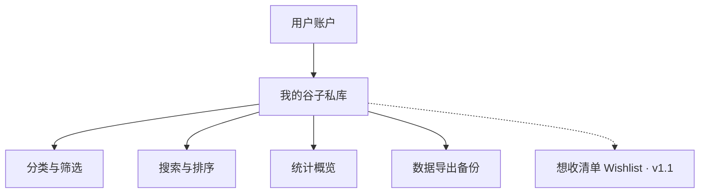

# 二次元谷子私库管理应用 — 功能需求说明（收窄版）

> **范围说明**：当前阶段仅做**个人谷子私库管理**，默认全部数据仅自己可见。社区、公开分享、以图搜周边、标准百科库、商城交易等功能均不在本阶段范围内，列入后续路线图。

---

## 1. 产品定位

面向**二次元周边收藏玩家**的**个人谷子私库管理工具**。帮助用户记录、整理自己拥有的谷子/手办/卡牌/同人制品等，解决「买了什么、花多少钱、放在哪、什么状态」的管理问题。

**一句话价值**：我的谷子收藏柜 —— 私密、清晰、随时可查。

**本阶段不做**：

| 暂不做 | 原因 |
|--------|------|
| 社区动态、点赞评论 | 非私库核心，开发与运营成本高 |
| 公开晒谷 / 分享卡片 | 等私库稳定后再评估 |
| 以图搜周边 / 标准百科库 | 技术重、数据重，与私库管理可解耦 |
| 商城、交易、拼团 | 完全不同赛道 |
| 再贩提醒、市价追踪 | 依赖外部数据源 |

---

## 2. 目标用户

| 用户类型 | 典型场景 |
|---------|---------|
| 轻度收藏者 | 偶尔买谷子，需要简单记录和防重复购买 |
| 重度收藏家 | 大量 SKU、限定款、二手购入，需要分类、状态、投入统计 |
| 同人/展会玩家 | 频繁入手同人制品，需要标签、来源、作者信息 |
| 整理型用户 | 想知道自己有哪些、总花费、各 IP 分布 |

---

## 3. 核心问题（要解决什么）

1. **记不住**：买了什么、在哪买的、多少钱、是否已出荷/到货
2. **难整理**：同 IP 多角色、多版本、限定/再贩难以区分
3. **怕买重**：入库后搜不到，线下/闲鱼扫货时重复购入
4. **难复盘**：总投入、各品类数量不清晰

---

## 4. 功能模块概览



---

## 5. 详细功能需求

### 5.1 用户与账户

| 功能 | 说明 | 优先级 |
|-----|------|--------|
| 登录 | 微信一键登录 | P0 |
| 基础资料 | 昵称（可选），无公开个人主页 | P1 |
| 数据隔离 | 所有藏品数据默认仅本人可见，无私开选项 | P0 |

---

### 5.2 我的谷子私库（核心）

用户可将每件谷子作为一条**藏品记录**管理。

#### 5.2.1 藏品录入

| 功能 | 说明 | 优先级 |
|-----|------|--------|
| 手动添加 | 填写名称、IP、角色、品类、购入价、购入日期、来源等 | P0 |
| 拍照/相册导入 | 上传 1～多张图片（主图 + 细节图） | P0 |
| 复制条目 | 同款复数枚时快速复制并修改 | P1 |
| 批量录入 | 同品类连续录入优化 | P2 |
| 扫码录入 | 扫描 JAN/商品条码（若数据可得） | P2 |

**录入门槛**：名称与图片至少填一项即可保存，其余字段可选。

#### 5.2.2 藏品信息字段

| 分组 | 字段 |
|------|------|
| **识别** | 名称、IP/作品、角色、品类（吧唧/立牌/手办/色纸/卡牌/抱枕/同人本/其他） |
| **版本** | 通常版 / 限定 / 再贩 / 展会限定 / 同人 |
| **同人（可选）** | 社团、作者（支持同人谷） |
| **状态** | 未发货 / 已到货 / 未拆 / 已拆 / 已出 / 损坏 |
| **交易（默认私密）** | 购入价、币种、购入日期、购入渠道、订单号 |
| **整理** | 标签（自由）、存放位置、备注 |

#### 5.2.3 组织与检索

| 功能 | 说明 | 优先级 |
|-----|------|--------|
| 列表/网格浏览 | 网格视图优先（适合谷子展示） | P0 |
| 分类筛选 | 按 IP、角色、品类、状态、标签筛选 | P0 |
| 关键词搜索 | 名称、角色、IP、备注 | P0 |
| 排序 | 最近添加、购入日期、价格、名称 | P1 |
| 批量改标签 | 多选后统一修改标签 | P2 |
| 数据导出 | 导出 CSV / JSON，支持全量备份 | P0 |

#### 5.2.4 统计与概览

| 功能 | 说明 | 优先级 |
|-----|------|--------|
| 收藏概览 | 总数、品类分布、IP 分布 | P1 |
| 投入统计 | 总购入价、本月新增（用户可开关是否展示金额） | P1 |

#### 5.2.5 编辑与删除

| 功能 | 说明 | 优先级 |
|-----|------|--------|
| 编辑 | 修改任意字段与图片 | P0 |
| 删除 | 支持删除；可选回收站（P2） | P0 |

---

### 5.3 本阶段不包含的功能（路线图）

以下功能在需求中保留规划，**不纳入当前 MVP**：

#### v1.1 — Wishlist（第一版后首批迭代）

| 功能 | 说明 |
|------|------|
| 想收清单 | 独立表 `wishlist_items`，与已拥有分开展示 |
| 标记为已拥有 | 复制到 `owned_items` 并补全购入信息；**不自动删除** wish 条目，由用户在想收列表中手动删除 |

#### Phase 2 — 体验增强

| 功能 | 说明 |
|------|------|
| 到货提醒 | 标记「未发货」+ 预计到货日 |
| 批量导入 | 从订单截图或表格批量录入 |
| 离线只读 | 本地缓存私库，无网可浏览 |
| IP 自动补全 | 基于历史输入的智能建议 |

#### Phase 3 — 分享（仍可不做人际社区）

| 功能 | 说明 |
|------|------|
| 晒谷长图 | 从私库生成九宫格/清单长图 |
| 隐私可控分享 | 分享时隐藏价格、位置等字段 |

#### Phase 4 — 发现与标准库（差异化，单独立项）

| 功能 | 说明 |
|------|------|
| 以图搜周边 | 拍照匹配标准库条目 |
| 周边详情页 | 发售信息、参考价、参考图集 |
| 标准库建设 | 自建 / 聚合第三方数据 |

#### 不做或远期

| 功能 | 说明 |
|------|------|
| 社区动态、点赞评论 | 除非产品方向调整 |
| 商城、拼团、交易 | 非本产品线 |
| 再贩/补货提醒 | 依赖外部数据源 |

---

## 6. 典型用户流程

### 流程 A：到货入库

1. 拍照或从相册选图（本地预览）
2. CRV `files/upload` → 取得 `path`（或与文字字段一并 save）
3. 填写名称 / IP / 品类 / 购入价 / 存放位置
4. CRV `data/save` 写入 `owned_item`（含 `photos` file 字段）

### 流程 B：防重复购买

1. 在私库中搜索 IP + 角色（或扫一眼网格）
2. 确认是否已有同款或同系列
3. 决定是否购入

---

## 7. 非功能需求

| 类别 | 要求 |
|-----|------|
| 平台 | **微信小程序** + **定制 Auth Service** + **CRV/crvframe** + MySQL + OSS（见 [tech.md](./tech.md)、[integration.md](./integration.md)） |
| 性能 | 列表在 500 条内流畅滚动；搜索响应 ≤ 1s |
| 存储 | 图片压缩上传；云端持久化 |
| 隐私 | 全部数据默认私密；价格/订单/位置不对他人展示 |
| 可靠性 | 支持数据导出，防止换机丢失 |
| 合规 | 用户上传图片需符合平台内容规范 |

---

## 8. MVP 范围（第一版）

### 第一版 MVP（P0）

- 微信登录
- 已拥有谷子私库：新增 / 编辑 / 删除
- 拍照/相册上传图片（含同人谷：社团/作者可选字段）
- 列表 + 网格浏览
- 按 IP、品类、状态、标签筛选 + 关键词搜索
- 数据导出（CSV 或 JSON）
- **完全免费**，无内购

### 第一版可选（P1，时间允许则做）

- 排序（购入日期、价格、名称等）
- 统计概览（总数、品类/IP 分布）
- 投入统计（可开关）
- 复制条目

### 明确不做（第一版）

- **Wishlist（想收清单）** → 见 v1.1
- 社区、公开主页、晒谷分享
- 以图搜、标准详情库
- 商城、交易、再贩提醒
- 条码扫描、批量导入
- 手机号登录、付费功能

---

## 9. 验收标准

| 指标 | 目标 |
|------|------|
| 录入效率 | 有图 + 最少字段，完成一条录入 ≤ 30 秒 |
| 检索 | 按 IP 搜索 ≤ 1 秒返回 |
| 规模 | 100～500 条数据下列表仍流畅 |
| 数据安全 | 支持导出全部私库数据 |
| 范围 | 无社交、无公开页、无商城 |

---

## 10. 数据模型

> 物理表与字段由 **crvframe 模型配置**定义；下列为逻辑模型。对接映射见 [integration.md](./integration.md)。

### 第一版（MVP）

```
User（CRV core_user，Auth 同步）
  ├── id (= sub), openid, nickname, user_name_zh, user_name_en, ...
  ├── roles（many2many → core_role，中间表 core_role_core_user）

CoreRole（CRV core_role）
  ├── id, remark
  └── 审计：version, create_user, create_time, update_user, update_time

OwnedItem（CRV modelId: owned_item）
  ├── id, version（乐观锁）
  ├── 识别：name, ip, character_name, category, version_type
  ├── 同人：circle, author（可选）
  ├── 状态：status, location
  ├── 标签：tags（主表 VARCHAR，`,tag1,tag2,` 格式）
  ├── 交易：purchase_price, purchase_date, purchase_source, order_no（私密）
  ├── 媒体：photos（file 虚拟字段 → attach + OSS path）
  ├── 审计：create_user, create_time, update_time（CRV 自动）
  └── 备注：note
```

第一版**仅** `owned_item` 主模型（含 `photos` 附件），不建 Wishlist 模型。

### v1.1（Wishlist 迭代）

```
WishlistItem（想收 · wishlist_items，独立表）
  ├── userId
  ├── 识别：name, ip, character, category, versionType
  ├── 同人：circle, author（可选）
  ├── 整理：tags（同 owned_item 文本格式）, note
  ├── 媒体：images[]（可选，参考图）
  └── createdAt, updatedAt

「标记为已拥有」：复制字段 → 写入 owned_items → wish 条目保留，用户手动删除
```

本阶段**不需要** `StandardProduct`（标准库）表，待 Phase 4 以图搜功能再引入。

---

## 11. 产品决策（已定稿）

| # | 决策项 | 结论 |
|---|--------|------|
| 1 | 平台 | **微信小程序** |
| 2 | 登录 | **仅微信登录**；由 **定制 Auth Service（Golang）** 桥接微信并换取 **CRV Session（`usr_...`）**（见 [tech.md §3](./tech.md#3-定制-auth-service微信登录)） |
| 3 | 业务数据 | **CRV Service**：`query` / `save` / 文件 upload / download（[public_api.md](./public_api.md)） |
| 4 | Wishlist | **独立模型**；**不进第一版**，v1.1 再做 |
| 5 | 收费 | **第一版完全免费** |
| 6 | 同人谷 | **支持**；版本类型含「同人」，可选填社团、作者 |
| 7 | 想收→已拥有 | 复制到已拥有后，**wish 条目保留**，由用户**手动删除** |

---

## 12. 竞品参考（私库方向）

| 产品 | 可借鉴 | 本产品的差异空间 |
|------|--------|------------------|
| 谷谷 | 谷子专属字段、交易账本 | 微信小程序 / Android；导出备份；更清晰筛选 |
| 收纳小屋 | 分类、位置、批量拍照录入 | 二次元默认品类，免从零建分类 |
| MyFigureCollection | 字段设计、Wishlist 概念 | 不做社区，只做轻量私库 |

---

## 13. 名词与边界说明

- **「谷子」**：与二次元 IP 相关的实体周边（吧唧、立牌、手办等），含官方与同人。
- **「私库」**：用户个人的藏品清单，默认仅本人可见，不支持公开浏览。
- **「Wishlist」**：想收但未拥有的清单（v1.1）；独立数据表，与「已拥有」分开展示。

---

## 14. 后续可交付物

1. ~~**信息架构 + 页面清单**（小程序 Tab + 约 8～10 页）~~ → 见 [pages.md](./pages.md)
2. ~~**MVP 用户故事**（User Story + 验收标准）~~ → 见 [user-stories.md](./user-stories.md)
3. ~~**技术选型**~~ → [tech.md](./tech.md)（Auth Service + CRV + MySQL + OSS）
4. ~~**CRV 对接说明**~~ → [integration.md](./integration.md)
5. ~~**数据库 DDL**~~ → [schema.sql](./schema.sql)
6. **线框图**（录入页、列表页、详情页、统计页）
