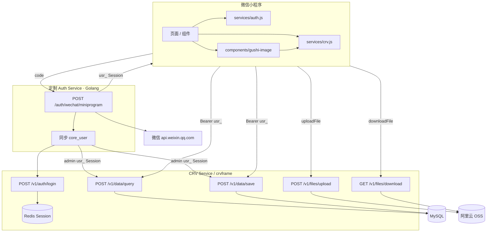

# 谷子私库 — 技术选型与架构说明

> 基于 [res.md](./res.md)、[pages.md](./pages.md)、[user-stories.md](./user-stories.md)、[public_api.md](./public_api.md)。  
> **已定栈**：微信小程序原生 + **定制 WeChat Auth Service（Golang）** + **CRV Service / crvframe** + **MySQL** + **阿里云 OSS（经 CRV 代理）**

---

## 1. 技术栈总览

| 层级 | 选型 | 说明 |
|------|------|------|
| 客户端 | **微信小程序原生** | WXML + WXSS + JavaScript |
| 登录 | **定制 Auth Service（Golang）** | `wx.login` → code2session → 同步用户 → 换取 **CRV Session**（`usr_...`） |
| 业务数据 | **CRV Service / crvframe** | `query` / `save` / 文件 upload / download |
| 数据库 | **MySQL** | 由 crvframe 模型驱动（谷子 schema） |
| 图片 | **阿里云 OSS** | 经 CRV `POST /v1/files/upload` 写入；`GET /v1/files/download` 读取 |
| 导出 | **小程序端** | 分页 `query` 拉全量后本地生成 CSV/JSON（P0） |

### 1.1 职责划分

| 组件 | 做什么 | 不做什么 |
|------|--------|----------|
| **小程序** | UI、微信登录、调 Auth + CRV | 直连 OSS、直连 MySQL |
| **定制 Auth Service** | 微信登录、用户映射、同步 `core_user`、代用户换取 CRV Session | 谷子 CRUD、文件流 |
| **CRV / crvframe** | Session 管理、模型元数据、query/save、datasets 权限、OSS 读写 | 微信小程序 code 交换 |

API 细节见 [public_api.md](./public_api.md)（**v1.4**：Redis Session）；谷子字段与请求映射见 [integration.md](./integration.md)。

---

## 2. 系统架构



### 2.1 数据流原则

| 操作 | 实现方式 |
|------|----------|
| 登录 | `wx.login` → **Auth Service** → 返回 CRV **`usr_...` Session** + `schema` |
| 列表 / CRUD | **CRV** `query` / `save`；`Authorization: Bearer usr_...`（**session 模式无需** `X-Schema`） |
| 图片上传 | **CRV** `upload` → `path` → `save` 的 `file` 虚拟字段 |
| 图片展示 | **CRV** `download` + `maxWidth` → `wx.downloadFile` → 本地 `tempFilePath` |
| 导出 | 分页 **query** 全量 → 小程序生成 CSV/JSON |
| 统计（P1） | **query** + `withSummarize` 或客户端聚合 |

> **注意**：`<image src="https://api.../download">` 无法带 `Authorization`，必须通过 `wx.downloadFile` 下载后再展示。

---

## 3. 定制 Auth Service（微信登录）

### 3.1 与 CRV 的对接方式（public_api v1.4）

CRV 生产环境采用 **Redis Session**（[public_api.md §3](./public_api.md#3-认证)）：

- 令牌为**不透明**字符串：`usr_...`（用户 Session）或 `int_...`（集成令牌，公开签发接口尚未开放）
- Session 存 `sub`、`roles`、`schema`；受保护接口从 Redis 校验，**不再支持外部 JWT / JWKS**
- 小程序**不直接**调用 CRV `/v1/auth/login`（无账密 UI），由 **Auth Service** 完成微信身份验证后代为换取 Session

Auth Service 职责：

1. 微信 `code2session` → `openid`
2. 用 **admin `usr_` Session** 在 CRV 同步 `core_user`（create/update + 绑定 `gushi_user` 角色）
3. 代用户调用 CRV `POST /v1/auth/login`（使用 `core_user` 的服务端内部密码，用户无感知）
4. 将 CRV 返回的 `access_token`（`usr_...`）、`schema`、`expires_in` 转给小程序

> **实现状态**：`auth-service/` 目录下当前代码仍为 JWT 草案，须按本节与 [integration.md §3](./integration.md#3-认证对接) 重构。

### 3.2 建议接口

```http
POST {auth_base_url}/auth/wechat/miniprogram
Content-Type: application/json

{
  "code": "<wx.login>",
  "nickname": "收藏家",
  "avatar_url": "https://..."
}
```

**成功响应（示例）：**

```json
{
  "access_token": "usr_xK9mN2pQ...",
  "token_type": "Bearer",
  "expires_in": 900,
  "is_new_user": true,
  "user": {
    "id": "u_xxx",
    "nickname": "收藏家",
    "avatar_url": "https://..."
  }
}
```

| 字段 | 说明 |
|------|------|
| `access_token` | CRV Session 令牌（`usr_` 前缀），小程序原样用于 CRV 请求 |
| `expires_in` | **空闲**过期秒数（默认 900）；每次 CRV 成功请求会**滑动续期** |

### 3.3 Session 与权限（服务端）

CRV Session 记录（非响应字段，见 public_api §3.1）：

| 字段 | 谷子对应 |
|------|----------|
| `sub` | `core_user.id`（= datasets `%{CURRENT_USER_ID}`） |
| `roles` | 来自 `core_role_core_user`，如 `["gushi_user"]` |
| `schema` | `gushi` |

### 3.4 用户生命周期

1. `code2session` → `openid`
2. CRV 查/建 `core_user`，新用户生成稳定 `id`（`sub`）并写入内部 `password`
3. Auth 调 CRV `/v1/auth/login` → 返回 `usr_...`
4. 小程序存 token + schema；启动时若 Session 失效（401）→ 重新 `wx.login` 走 Auth

---

## 4. CRV / crvframe 业务接入

### 4.1 租户

| 项 | 建议值 | 说明 |
|----|--------|------|
| schema / appDb | `gushi` | 登录 `appid` 映射（`CRVSVC_APP_SCHEMA_MAP_JSON`） |
| 主模型 | `owned_item` | 见 [integration.md](./integration.md) |
| 附件 | `photos`（file 虚拟字段） | 默认 attach 表 `owned_item_attach` |

### 4.2 核心 API（public_api v1.4）

| 能力 | 路径 |
|------|------|
| 登录（Session） | `POST /v1/auth/login` |
| 查询 | `POST /v1/data/query` |
| 保存 | `POST /v1/data/save` |
| 上传 | `POST /v1/files/upload` |
| 下载 | `GET /v1/files/download` |
| 元数据 | `GET /v1/meta/models` |

**认证模式**：`CRVSVC_AUTH_MODE=session`（或别名 `jwt`），依赖 Redis（`CRVSVC_REDIS_ADDR`）。

### 4.3 数据权限（datasets.json）

每个模型**必须**配置 `apps/gushi/{modelId}/datasets.json`，否则 query/save 返回 **403**。

谷子私库建议：

- 共用 role：`gushi_user`
- 行级 Filter：`create_user = %{CURRENT_USER_ID}`（= Session `sub`）
- `queryRoles` + `mutationRoles` 均包含 `gushi_user`

### 4.4 乐观锁

`update` / `delete` 须带 `id` + `version`；冲突 HTTP **409** / `code=40901`，需重新 query 后提交。

---

## 5. 谷子图片流程

### 5.1 新增（自增主键时常见两步）

```text
1. save create（文字字段，可无图）
2. query → 得 id、version
3. 每张图：upload → path
4. save update + photos.file 虚拟字段 list
```

表单内**未 save** 的本地图：用 `wx.chooseMedia` 的 **临时路径** 预览，save 后再 upload。

### 5.2 列表 / 详情展示

```text
1. query（fields 含 file 嵌套，得 attachId）
2. GET /v1/files/download?modelId&rowId&fieldId&attachId&maxWidth=400
3. wx.downloadFile({ header: { Authorization: Bearer usr_... } })
4. <image src="{{tempFilePath}}" />
```

列表建议对 `attachId` 做 **内存缓存**，避免重复下载。

---

## 6. 小程序工程结构

```
gushi/
├── miniprogram/
│   ├── config/
│   │   └── env.js              # AUTH_BASE_URL, CRV_BASE_URL
│   ├── services/
│   │   ├── auth.js             # 微信登录 → Auth Service → usr_ Session
│   │   ├── crv.js              # query / save / upload / download 封装
│   │   ├── item.js             # 谷子业务（modelId、字段映射）
│   │   └── export.js
│   ├── components/
│   │   └── gushi-image/        # downloadFile + 缓存
│   └── pages/                  # 见 pages.md
├── auth-service/               # 定制 Golang 微信登录（独立部署）
└── docs/
    ├── public_api.md           # CRV 公开 API v1.4
    ├── integration.md          # 谷子 ↔ CRV 映射
    └── ...
```

### 6.1 双 Base URL

| 变量 | 用途 | 小程序合法域名 |
|------|------|----------------|
| `AUTH_BASE_URL` | 微信登录 | request |
| `CRV_BASE_URL` | 数据 + upload + download | request、uploadFile、downloadFile |

---

## 7. 逻辑数据模型（CRV 模型层）

业务字段在 crvframe **model 配置**中定义，逻辑上对应 [res.md §10](./res.md#10-数据模型)：

| 逻辑实体 | CRV modelId（建议） | 说明 |
|----------|---------------------|------|
| 用户 | `core_user` | Session `sub` = `core_user.id` |
| 已拥有谷子 | `owned_item` | 含 version、审计列 |
| 图片 | `owned_item.photos`（file 虚拟字段） | attach 表 + OSS path |

第一版不做 Wishlist 模型（v1.1 再加 `wishlist_item`）。

---

## 8. 非功能需求对照

| 需求 | 实现 |
|------|------|
| 仅微信登录 | Auth Service |
| 私库隔离 | Session `sub` + datasets Filter |
| 搜索 ≤1s | query + 索引 + 分页 |
| 500 条流畅 | 分页、`maxWidth` 缩略图、download 缓存 |
| 导出 | 客户端分页 query |
| HTTPS | Auth + CRV 全链路 |

---

## 9. 开发顺序

1. crvframe：创建 `gushi` schema、模型、`datasets.json`；配置 Redis Session
2. Auth Service：微信登录 → 同步 `core_user` → 换取 CRV `usr_` Session
3. 小程序：`auth.js` + `crv.js` + 登录页
4. 谷子 CRUD + upload/save/file
5. `gushi-image` 组件 + 列表/详情
6. 导出、统计（P1）
7. 按 [user-stories.md](./user-stories.md) P0 验收

---

## 10. 待定项（实现前与 crvframe 运营确认）

| 项 | 说明 |
|----|------|
| CRV `/v1/auth/login` 的 `username` 字段 | 对应 `core_user.id` 还是 `user_name_en` |
| 内部 `password` 策略 | Auth 为新用户生成随机密码仅存服务端 |
| admin Session 开户权限 | provisioner 用 admin `usr_` 调 save 是否满足 datasets |
| `%{CURRENT_USER_ID}` | 是否等于 Session `sub` |
| Session 空闲 TTL | 默认 900s；小程序冷启动是否静默重新登录 |
| 生产 / 测试 Base URL | public_api 联系与支持节 |

---

## 11. 文档索引

| 文档 | 内容 |
|------|------|
| [res.md](./res.md) | 产品需求与 MVP 范围 |
| [pages.md](./pages.md) | 页面与 Tab |
| [user-stories.md](./user-stories.md) | 用户故事与验收 |
| [public_api.md](./public_api.md) | CRV HTTP API（**v1.4**） |
| [integration.md](./integration.md) | 谷子业务 ↔ CRV 对接细则 |
| [schema.sql](./schema.sql) | MySQL DDL |
